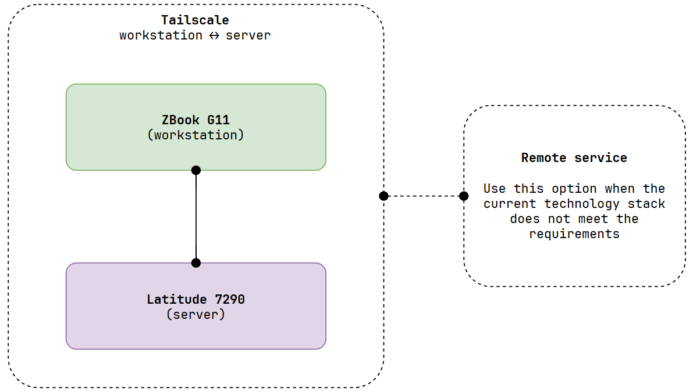

<div align="center">

# Dual-Machine

[](https://ubuntu.com/wsl)
[](https://ubuntu.com/server)
[](https://github.com/tkt-gemini/workflow)
[](./LICENSE)

**Workflow for Embodied AI**

</div>

---

## Machine Specifications

| Machine | OS | Disk | RAM | CPU | GPU-0 | GPU-1 | NPU |
| --- | --- | --- | --- | --- | --- | --- | --- |
| **ZBook G11** | Windows 11 Pro | 1 TB SSD | 32 GB | Intel(R) Core(TM) Ultra 7 165H | NVIDIA RTX 1000 Ada | Intel(R) Arc(TM) Pro Graphics | Intel(R) AI Boost |
| **Latitude 7290** | Ubuntu 26.04 LTS (server) | 256 GB SSD | 8 GB | Intel(R) Core(TM) i5-8350U | `None` | Intel UHD Graphics 620 | `None` |

## Architecture

<div align="center">



</div>

## Setup

### WSL2

#### Install

Launch your preferred Windows Terminal / Command Prompt / Powershell and install WSL:
``` bash
wsl.exe --install
```

Ensure you have the latest WSL kernel:
```bash
wsl.exe --update
```

#### Configuration
Setup a Linux Development Environment for WSL2 is [here!](https://github.com/tkt-gemini/wsl)

### Server

Download Ubuntu Server ISO file [here!](https://ubuntu.com/download/server)

Next, use [Rufus](https://rufus.ie) to create a bootable USB drive and install the server ✨

### Tailscale

**For server:**
``` bash
curl -fsSL https://tailscale.com/install.sh | sh
```

**For Windows:**
```
https://tailscale.com/download
```
